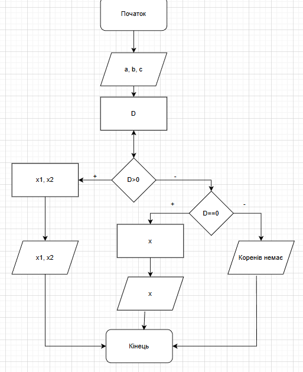

# Програма - таймер
*Використані технології:* 
- Мова програмування С
- Visual Studio 2022
*Опис:*
- Користувач вводить кількість часу і через задану кількість часу буде програно звуковий ефект
# Програма для обрахунку коренів квадратного рівняння
*Використані технології:* 
- Мова програмування С
- Visual Studio 2022
- diagrams.net
*Опис:*
- Користувач вводить a, b, c і програма вираховує корені
