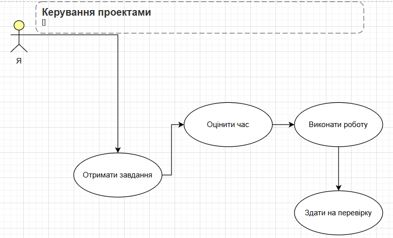

# Процес роботи
Я дотримуюся послідовного підходу до виконання завдань, що дозволяє
ефективно планувати час.
# Етапи роботи
- Аналіз вимог — вивчаю умову завдання.
- Планування — визначаю основні етапи реалізації.
- Виконання — реалізую рішення.
- Тестування — перевіряю правильність роботи та виправляю помилки.
## UML Use Case діаграма
